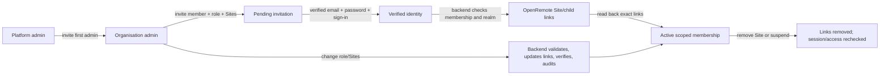

# ЧЕРНОВА · Матрица GrideX ↔ OpenRemote / DRAFT · Access-rights matrix

**Статус: за одобрение; не е приложена на живо.** Това е проверен проект за
съгласуване на правата, не разрешение за промяна на роли. Няма ново меню или
нова функция за клиента. Одобрените екрани в „Клиенти и договори → Потребители
и покани“ и „Обекти“ остават на същите места. Новият екран за членове още не е
внедрен на живо (виж `INCIDENT_MEMBER_ACCESS_021.md`).

**Status: draft for owner approval; not applied in production.** Existing menu
placement and approved member screens remain unchanged. No identity, realm,
role, Asset or user–Asset link was changed by this audit.

## Решение за собственика — български преглед

GrideX има собствени роли и права в backend-а, а OpenRemote има отделни
`read:*`/`write:*` роли и `restricted_user`. Достъпът до Обект трябва да
изисква едновременно активно членство/разрешен Обект в GrideX **и** проверена
връзка към точните Assets в OpenRemote. Скрит бутон в нашия frontend не
ограничава директен вход в OpenRemote Manager.

| Човек | Проверено сега в OpenRemote | Цел след одобрение |
| --- | --- | --- |
| Супер администраторът в пилотната организация | `read:assets`, `restricted_user` | Запазва ограничен личен вход; управлява останалите организации само чрез проверени backend действия. |
| Администратор на Новаком | `read:admin`, `read:assets`, `read:users`, `write:admin`, `write:assets`, `write:attributes`, `write:user`; без `restricted_user` | Личният Manager вход става само за четене и само за разрешените Assets. Създаване на Обект, устройства, покани и права — през GrideX backend. |
| Наблюдател в Новаком | Няма зададени OpenRemote роли | `read:assets` и `restricted_user`, само изрично свързаните Обекти и разрешените за четене атрибути. |

| Роля в GrideX | Какво се прави през GrideX | Директен OpenRemote Manager по целевата схема |
| --- | --- | --- |
| Супер администратор | Нови организации, преглед/управление през проверени API операции | Ограничен личен достъп за четене, без глобален браузърен токен |
| Администратор на организация | Създава Обекти, кани хора, задава роли/Обекти, пуска разрешеното оборудване | Чете само своите Assets; не създава/редактира директно |
| Наблюдател | Чете разрешените данни | Само четене на свързаните Assets |
| Оператор | Разрешени команди през GrideX за зададен Обект | Същото ограничено четене; няма директно `write:assets` |
| Енергиен мениджър | Разрешени стратегии и настройки през GrideX | Същото ограничено четене; няма директно `write:assets` |
| Интегратор | Разрешени настройки на устройства за зададен Обект; не създава нов Обект | Същото ограничено четене; няма директно `write:assets` |

**Поток:** покана → проверени имейл, парола и вход → backend проверява realm,
членство, роля и Обект → създава/проверява точните OpenRemote връзки →
активен достъп. При промяна или отнемане на Обект backend актуализира
връзките, прочита ги повторно и записва одит. При грешка не съобщава успех;
частичните промени се възстановяват или се отбелязват за съгласуване.
Няма нов имейл за промяна на роля. Съществуващите форми и менюта остават;
супер админът преглежда по организация, организационният админ редактира
роля/Обекти, обикновеният потребител няма администраторска форма.

**Оставащите две решения:**

1. Да стане ли директният OpenRemote Manager **само за четене за всички
   човешки акаунти**, включително администраторите на организации?
2. За запис в OpenRemote разрешаваш ли отделен служебен клиент във всеки
   realm с `read:assets` и `write:assets`? Последното право позволява и
   обща редакция на Assets, макар GrideX backend да ограничава обичайните
   заявки. Ако този риск е неприемлив, първо е нужна отделна, тясна
   възможност за връзки в OpenRemote; вградено такова право не е потвърдено.

Без изричен отговор на двете точки не се променят живи права и не се
включва новият екран.

## Проверени източници и факти / Verified sources and facts

- GrideX permissions: `services/gridex-api/src/auth.mjs`; Site creation and
  gateway provisioning: `inventory-provisioning.mjs`; membership/Site scope:
  `invitations.mjs` and `repository.mjs`.
- OpenRemote [Manager guide](https://docs.openremote.io/docs/user-guide/manager-ui/):
  client roles decide operations; `restricted_user` plus explicit Asset links
  constrain visible Assets. Restricted users see only attributes marked for
  restricted read/write.
- OpenRemote [Asset API](https://docs.openremote.io/docs/rest-api/asset/):
  `read:assets` reads Assets and links; `write:assets` creates/updates/deletes
  Assets **and** creates/deletes user–Asset links. There is no demonstrated
  built-in role limited to links alone. `write:attributes` is separate.
- A read-only production inspection on 2026-10-02 found these current
  memberships (no credentials or user IDs recorded):

| GrideX membership | OpenRemote client roles now | Realm role now | Gap |
| --- | --- | --- | --- |
| Pilot `gridex` administrator and platform administrator | `read:assets` | `restricted_user` | Cannot write user–Asset links with the human token. |
| `novacom` organisation administrator | `read:admin`, `read:assets`, `read:users`, `write:admin`, `write:assets`, `write:attributes`, `write:user` | none | Can create/edit Assets directly in Manager, bypassing GrideX provisioning. |
| `novacom` viewer | none | none | GrideX membership does not provision equivalent OpenRemote read/Site access. |

This is a snapshot, not a claim that all future accounts have the same roles.
Check every account before migration. `novacom` and the pilot realm are
isolated; never use one as a catch-all tenant.

## Целева матрица за одобрение / Proposed human-role matrix

The GrideX role and explicit Site grants remain the browser/API authority.
For **every human account**, OpenRemote would have only `read:assets` and
realm role `restricted_user`, plus links to the exact permitted Site and
required child Assets. No human receives `write:assets`, `write:admin`,
`write:user` or `write:attributes` solely because of their GrideX role.
All writes go through the GrideX API after current membership, Site, service,
session and action checks. A direct Manager session becomes read-only for
organisation administrators as well. This is a material behavior change.

| GrideX role | GrideX API authority (current approved scope) | Direct OpenRemote target | Site scope |
| --- | --- | --- | --- |
| Platform administrator | Platform onboarding, organisation/service oversight; also administrator of pilot organisation | Own human token: `read:assets` + `restricted_user`; cross-realm actions only through audited backend | Pilot links for own account; other realms checked by backend, never a global browser token |
| Organisation administrator | Create Sites, invite members, select Sites/roles, provision approved devices, commission | `read:assets` + `restricted_user`; **no direct Manager Asset/role writes** | All Sites of own organisation, linked as they are created |
| Viewer | Read approved Sites and data | `read:assets` + `restricted_user`; no writes | Explicit Sites only |
| Operator | Approved commands for assigned Sites through GrideX API | Same read-only OpenRemote roles; commands are mediated by GrideX | Explicit Sites only |
| Energy manager | Approved configuration/strategy actions through GrideX API | Same read-only OpenRemote roles; changes are mediated by GrideX | Explicit Sites only |
| Integrator | Approved device configuration for assigned Sites through GrideX API; not new Site creation | Same read-only OpenRemote roles; changes are mediated by GrideX | Explicit Sites only |

The matrix describes the **target**. The role strings in `auth.mjs` alone do
not guarantee a corresponding endpoint exists. In particular, today's Site
and gateway provisioning endpoints explicitly require organisation admin,
even though `integrator` has `asset:manage`/`hardware:manage`. Do not promise
an integrator a new-Site or gateway creation button as part of this change.
Service entitlements remain a separate organisation→member approval chain.

### OpenRemote Asset and attribute scope

An Asset link and `restricted_user` are not sufficient if required attribute
metadata is not readable by restricted users. Before migration, inventory
projection must verify the Site, ROCK/ESP and other approved child Assets,
their required attributes, and the exact user links. A zero-Site member must
have zero usable Asset links. A removed link must revoke visibility in both
OpenRemote and GrideX. Assets created directly in Manager do **not** appear
automatically in GrideX because the Site/device projection and binding are
absent; they must be reconciled, never silently imported.

## Служебен достъп: неразрешено решение / Service permission: unresolved choice

OpenRemote requires `write:assets` for both user–Asset links and general
Asset writes. A backend-only service client per organisation realm with
`read:assets` + `write:assets` would be isolated across realms and its secret
would never enter the browser, but its OpenRemote privilege is **broader than
link management**. GrideX API checks and audit would constrain ordinary
requests; compromise of the service credential would still allow wider
Asset changes inside that realm. The owner's previous approval explicitly
excluded such a broad permission. **Do not provision or deploy it without a
new explicit choice.** Do not expand the master setup client or a human role.

Alternative: implement/review a custom OpenRemote link-only authorization
capability (or equivalent upstream-supported mechanism), then use it for the
backend. That is a separate OpenRemote change, test and deployment, not an
assumed existing role. No link-writing path may claim least privilege before
this decision.

## Процес по роли / Role-by-role process (proposed)



- **Initiator/recipient:** platform admin starts first-admin onboarding;
  organisation admin invites/updates ordinary members in its realm; the
  recipient proves identity, but does not receive rights from email alone.
- **Authority:** Keycloak/OpenRemote owns identity, realm roles and Asset
  links; GrideX PostgreSQL owns approved membership role, Site grants and
  audit. GrideX serves data only on the intersection of both authorities.
- **Notifications:** preserve existing invitation email and service-request
  behavior. No new email or notification is proposed for role/Site edits.
- **Failure/retry:** any unverified Keycloak role or OpenRemote link fails
  closed; report a pending reconciliation rather than success. Make writes
  idempotent, audit the attempt, compensate partial links where safe, and
  require explicit inspection after failed compensation. Do not activate a
  membership with only a local SQL grant.
- **Revocation:** remove exact Site/child links before reporting success;
  invalidate or re-evaluate active sessions so old tokens do not retain
  write rights. Suspension must continue to block portal and Manager access.

## Екрани (без промяна на менюто) / Screens (no menu change)

```text
Супер администратор · Клиенти и договори → Потребители и покани
  [Организация ▼]  [Одобрени членове: име · имейл · роля · Обекти · статус OR]
  Преглед между организациите; без пряк бутон за OpenRemote роли.

Администратор на организация · същият раздел
  [Покани: име · фамилия · имейл · роля · Обекти] [Изпрати]
  [Член: роля ▼ · разрешени Обекти □ · проверка OR] [Запази]
  Само неговата организация; без управление на `write:assets` от браузъра.

Потребител · Обекти / Устройства
  Само изрично разрешените Обекти и данни; без администраторски форми.
```

These are the already approved page locations; this draft adds no navigation
item or new form. Existing form documentation remains authoritative for
labels and layout. Direct OpenRemote Manager would become read-only for human
organisation admins after migration; this difference needs owner approval.

## План и критерии за приемане / Migration and acceptance gates

1. Owner approves the human-role target **and** chooses the service-write
   solution. Record that decision here and in `HANDOFF.md` before code.
2. Implement future realm/member provisioning with explicit role mapping;
   never silently inherit/default `write:*` roles. Refactor Site/gateway
   creation, member link changes and first-admin setup to backend-authorized
   service operations. Remove the current dependence on the administrator's
   browser token for OpenRemote writes.
3. Audit all existing human roles and links, back up identity configuration
   and databases, then migrate pilot and `novacom` with exact before/after
   diff. Remove `novacom` admin's broad OpenRemote writes only **after**
   portal-based creation and role/Site operations pass. Never delete account,
   organisation or Asset.
4. Test each role with a real token in portal **and** direct Manager: Viewer,
   Operator, Energy manager, Integrator and organisation admin cannot create,
   update or delete an Asset directly; only assigned Sites and allowed
   attributes are visible. Confirm organisation admin can still create a Site
   and approved device through GrideX. Verify pilot owner and `novacom`
   separately; cross-realm and zero-Site requests return denial.
5. Test invitations, role/Site changes, revocation, concurrent changes,
   failed OpenRemote writes, rollback, session refresh and future-realm
   onboarding. Backend feature gate stays off until all checks pass. Deploy
   backend, then frontend and BG/EN help; verify live with owner.

### Exact decisions requested from owner

1. Should direct OpenRemote Manager be **read-only for every human account,
   including organisation administrators**, with all changes through GrideX?
2. For backend writes, approve the realm-local `read:assets` +
   `write:assets` service client with the documented residual risk, **or**
   require a custom link-only OpenRemote permission before rollout?

No live rights should change until both decisions are explicit.
