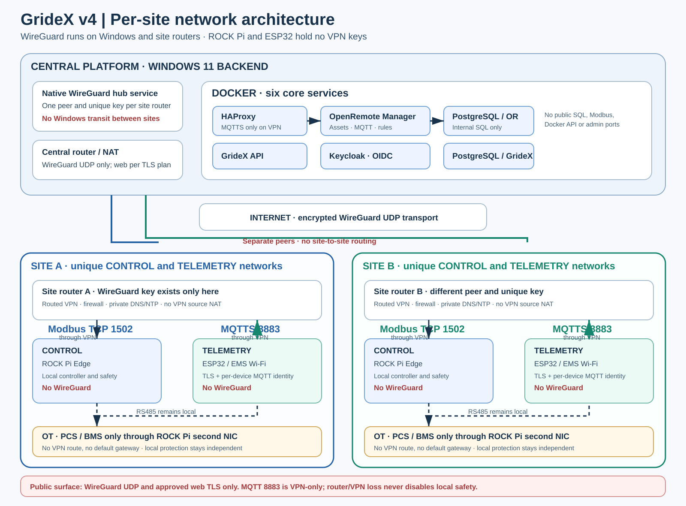

# GrideX — implementation plan v4.0

**VPN on site routers · 6 September 2026**
Status: accepted topology; implementation and runtime validation are pending. This document supersedes the v3 network decisions without closing unresolved API, Edge, database, or security findings. References: [SOURCES_EN.md](SOURCES_EN.md).

## 1. Effective architecture

Every site has a dedicated EMS router running WireGuard with a unique machine identity. Its WAN is untrusted and may be the Internet or a customer-managed LAN. EMS is never bridged into that network.

Windows 11 is the central WireGuard peer and runs the native `WireGuardTunnel$gridex` service outside WSL and Docker. One peer represents one site router; a separate Windows VPN application is not required for each site.

ROCK Pi and ESP32 run no WireGuard client and hold no VPN private key. ROCK Pi accepts Modbus only on its CONTROL interface and only from the approved backend. ESP32 uses MQTTS with its own device identity and the private backend VPN address routed by the site router. TLS remains mandatory inside the VPN.

Both IP channels depend on the same site router and VPN. They are not independently fault tolerant. There is no automatic public MQTT fallback. The local Edge controller, RS485 communications, and safety functions do not wait for the cloud. Their physical safe-state behavior requires separate engineering validation.

## 2. Zones and diagram

| Zone | Contents | Primary boundary |
|---|---|---|
| Central WAN ingress | Central router/NAT | UDP 51820; TCP 443/80 only under the approved web/TLS plan |
| Windows VPN hub | Native WireGuard service | One router peer per site; no site-to-site forwarding |
| Docker ingress | HAProxy and approved upstream paths | No wildcard MQTTS publication |
| Docker application/identity | GrideX API, OpenRemote Manager, Keycloak | Only required internal connections |
| Docker database | OpenRemote DB and separate GrideX DB | No host SQL port; separate roles and networks |
| Site CONTROL | ROCK Pi CONTROL Ethernet | Backend Modbus to Edge TCP 1502 only |
| Site TELEMETRY | ESP32 and isolated SSID/ports | MQTTS plus local DNS/NTP/DHCP only |
| Site OT | PCS/BMS behind the second ROCK Pi NIC | Never advertised or routed through VPN |
| Site-router management | Administrator access | Separate approved policy; never from ESP32 |

CONTROL and TELEMETRY are separate L2 segments/VLANs or physically separated networks. Different IP prefixes on one unrestricted LAN are not sufficient. TELEMETRY client/port isolation is required when an SSID or switch is shared, and the switch/AP must support the selected configuration.

## 3. Addressing and routing

Actual values are stored only in a private inventory outside Git. Every site receives unique values for `SITE_ROUTER_VPN_IP`, `SITE_CONTROL_CIDR`, `SITE_TELEMETRY_CIDR`, and `ROCKPI_CONTROL_IP`. Validate all prefixes for overlap with other sites, the Windows LAN, WSL, Docker, other VPNs, and the site WAN.

Version 1 does not translate overlapping site addresses. A conflict must be resolved by local renumbering before enrollment.

The Windows peer AllowedIPs contain exactly:

- the site-router tunnel address as /32;
- that site's CONTROL prefix;
- that site's TELEMETRY prefix.

The site router peer AllowedIPs contains only the backend VPN address as /32. The router must install the corresponding route; some firmware requires a separate route configuration. Do not include a default/full-tunnel route, OT prefix, office LAN, or another site.

Do not SNAT traffic inside the VPN. This is distinct from the ordinary outer NAT used to transport WireGuard UDP. [S2, S3]

Windows originates host/application connections but does not route traffic between sites. Do not enable ICS, bridges, RRAS, or global forwarding. Do not change WSL/Hyper-V adapters without a scoped review. The site router must route only the approved CONTROL/TELEMETRY-to-VPN flows under explicit firewall policy.

AllowedIPs are neither a TCP-port ACL nor device-level authentication. Router firewalling, Windows Firewall, TLS credentials, and application authorization remain mandatory.

## 4. Target services

| Service/process | Runtime | Required access |
|---|---|---|
| HAProxy | Docker | Approved public web ingress; MQTTS only on the hub VPN address |
| OpenRemote Manager | Docker | OR database, identity, proxy, and restricted site Edge egress |
| Keycloak | Docker | Identity endpoints and the supported OR database connection |
| OpenRemote PostgreSQL | Docker | Supported OpenRemote/Keycloak users only |
| GrideX PostgreSQL | Docker | Restricted API runtime role plus separate migration/admin roles |
| GrideX API | Docker | JWT, tenant and asset checks; GrideX DB and OpenRemote API |
| WireGuard hub | Native Windows service | UDP transport and approved private routes |
| Site WG/DNS/DHCP/NTP/firewall | Site router | Dependencies listed in the site runbook only |
| Migration/provisioning | Controlled one-shot jobs | Correct DB, realm, Assets, and rules |
| Backup/restore | Scheduled task | Both databases, configuration, trust, and revocation state |
| Monitoring/notifications | Restricted worker/external observer | Health, timeout, backlog, certificate, and alarm state |
| Forecasting/optimisation | Later stage | Validated data and no device/VPN/admin credentials |

The six persistent Docker services are the initial foundation, not a claim that every product function is implemented. A second broker, TimescaleDB, or Nginx is not added by default. Frontend hosting is not moved automatically.

## 5. Publication, DNS, and TLS

The central router may forward `UDP 51820` only to the Windows host. TCP 443 is reserved for approved web/API/authentication services. TCP 80 is used only by the selected ACME HTTP-01 or redirect plan; DNS-01 can avoid it but requires a separate implementation with restricted DNS credentials.

There is no public NAT rule for TCP 8883. MQTTS binds only to the backend VPN address, and the firewall accepts approved telemetry/device sources only. Remove legacy broad Docker mappings and firewall rules. Check IPv6, UPnP mappings, and additional network interfaces.

Never publish SQL, Modbus, Docker API, RDP, WinRM, SMB, metrics/admin ports, or development servers. Human administration uses a separate restricted path with MFA, not site-peer permissions.

Site split DNS resolves `EMS_TLS_HOSTNAME` to the backend VPN address inside EMS zones only. ESP32 connects using that DNS name and validates the certificate. Router DNS/NTP are restricted local services with approved upstream access for the router itself. Never disable TLS because of a clock problem.

Server certificates renew and reload automatically with failure alerts. Certificate lifecycle is separate from WireGuard machine-key policy. [S10]

## 6. Docker and Windows constraints

OpenRemote Manager requires controlled egress outside the isolated database network. Public Modbus or exposed SQL is not an acceptable workaround.

Measure the actual source address of Modbus traffic at the site router and ROCK Pi. The expected design uses a Windows host-originated connection through WireGuard, but Docker Desktop networking must be tested from the actual Manager container. [S4]

If the source differs from the design, do not allow complete Docker/WSL networks or enable global Windows forwarding. Apply a narrow, documented correction and repeat the negative tests.

Docker Desktop must support and enforce the TCP 8883 `host_ip` binding. If not, deployment is blocked; do not silently use a wildcard listener. [S5] The tunnel address must exist before ingress starts, and recovery after interface recreation must also be tested.

A Windows Firewall rule for `com.docker.backend.exe` does not prove per-container isolation. Container-level controls are still required. A VPN does not make a compromised API safe.

## 7. Site router and ROCK Pi

The router must support routed WireGuard, multiple isolated zones, explicit routes without VPN masquerade, split DNS, default-deny forwarding, anti-spoofing, configuration backup, and maintained firmware. Validate the exact model before purchase or deployment.

Only traffic arriving through WireGuard from the backend VPN source may reach ROCK Pi TCP 1502. TELEMETRY-to-CONTROL/OT/router-admin, other sites, and Windows administration are denied. Router administration is inaccessible from WAN and requires an explicit management/rescue policy.

ROCK Pi listens on its CONTROL address. OT uses the second NIC without a default gateway, bridge, or forwarding from CONTROL/VPN. Missing DHCP or a failed CONTROL listener must not stop the local safety and RS485 loop. A stable CONTROL address is required for autonomous boot.

Do not uninstall an existing ROCK Pi WireGuard service until the new router path is proven and a local rescue path exists.

## 8. Keys and identities

Each router generates a unique private key locally. A golden image or export contains no shared key. Windows stores its private key through the supported WireGuard/DPAPI mechanism. [S1]

Machine keys are not manually rotated on a calendar. WireGuard's automatic session-key behavior is separate. Replace or revoke a machine identity after compromise, router loss/replacement, ownership change, or an explicit security requirement. [S9]

Enrollment requires trusted verification of the public key and site ownership. A private registry records peer status, prefixes, revocations, and version without collecting site private keys. Revocation removes the peer and its routes from both active and persistent state. Restore must not reinstate revoked trust.

The server identity needs a protected recovery plan. A compromised hub key requires coordinated replacement. A DPAPI file alone is not a portable backup for another Windows installation. MQTT identity remains per device; a router key does not replace device/Asset authorization.

## 9. Outstanding blockers

Historical findings R01–R20 remain `OPEN` until current code is revalidated and fixes are proven. They cover authentication and tenant ACLs, database superuser use, TTL/schema/lease/replay, command atomicity, local meter/contract limits, bounded Modbus service, non-fatal bind recovery, truthful applied state, direct OpenRemote/MQTT write bypass, infrastructure isolation, dependencies, unattended boot, backup, and supporting services.

R21–R30 cover risks introduced by the shared site VPN path: router compromise, VLAN bypass, address overlap or SNAT, split DNS/TLS failures, legacy public TCP 8883, Windows transit, bootstrap, and incomplete migration. Details are in the [security review](GrideX_Security_Service_Review_EN_v4.md).

## 10. Work packages

| Package | Responsibility | Deliverable/acceptance |
|---|---|---|
| WP01 | Backend repository | One current plan; separate documentation and implementation PRs |
| WP02 | API/database | Unified API, JWT/tenant protection, restricted DB roles and migrations |
| WP03 | Backend services | Six services, HAProxy routes, health/readiness, restrictions |
| WP04 | Windows operations | Native WireGuard, protected storage, routes, firewall, no site transit |
| WP05 | Site networking | VLANs, unique router peer, routed VPN, DNS/NTP, ACLs |
| WP06 | Edge | CONTROL bind, local independence, TTL/lease/replay, measured limits |
| WP07 | MQTT/identity | Per-device permissions, TLS through VPN, data quality and age |
| WP08 | Operations | Monitoring, notifications, backup, revoke/restore, updates |
| WP09 | Validation | Tests from Manager, negative ACL tests, offline and reboot behavior |
| WP10 | Expansion | Repeatable site enrollment and canary rollout without shared key identity |

## 11. Release gates

- **G0 — documentation and isolated development:** no real device writes.
- **G1 — protected read-only pilot:** API, identity, network, TLS, DB, and isolation proven.
- **G2 — unattended operation:** cold Windows boot without login, service recovery, monitoring, backup, and router-outage behavior proven.
- **G3 — real control:** all control blockers closed and physical safe state measured and approved by an engineer.
- **G4 — advanced functions:** forecasting, optimiser, reports, and jobs accepted separately.

Real traffic or equipment tests require an approved scope. The [acceptance matrix](GrideX_Acceptance_Tests_EN_v4.md) contains 95 tests, all `NOT_RUN` at handoff. A documentation PR does not close a release gate.

## 12. Migration and rollback

Start with one laboratory site and read-only data. Protect the current configuration in a secure backup. Validate router routes, reverse path, firewall rules, and packet source. After acceptance, redirect Modbus and MQTTS, revoke the old ROCK Pi peer, remove the public MQTTS mapping and obsolete firewall allowances, and verify that legacy paths are closed.

Rollback is a controlled safe restoration with writes locked. It never automatically restores public MQTT, revoked keys, old active commands, or commissioning approval. Do not migrate all sites before a successful canary.

## 13. Inputs required before real configuration

Populate locally: Windows build/resources/interfaces; router models and firmware; non-overlapping CONTROL, TELEMETRY, and VPN prefixes; verified public keys; certificate/DNS process; actual image tags/digests; site Assets, users, and roles; private change window; and rescue access.

This package does not change any machine. The two runbooks define the future operational steps. Git contains only unexecuted plans and placeholders.
