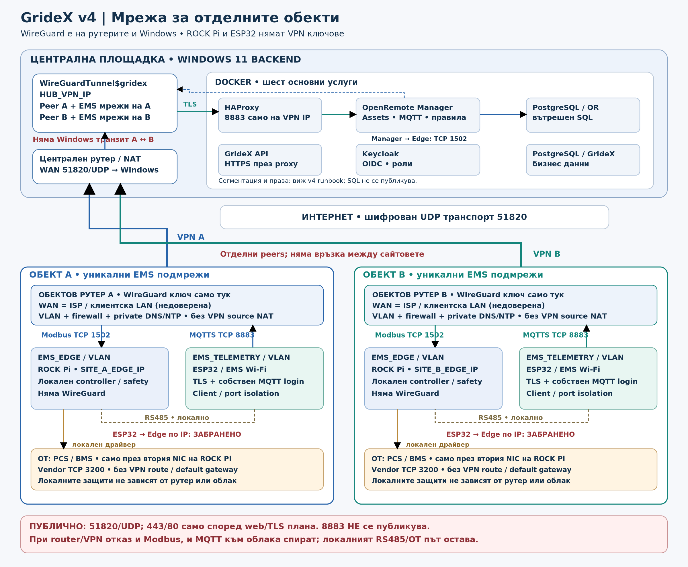

# GrideX — план за имплементация v4.0

**VPN на рутерите на обектите · 6 септември 2026 г.**
Статус: приета топология; имплементацията и реалните тестове предстоят.
Този документ заменя мрежовите решения във v3. Не отменя неотстранените
API/Edge/DB/security проблеми. Източници: [SOURCES.md](SOURCES.md).

## 1. Действащо решение

Всеки обект има отделен EMS рутер с WireGuard и уникална машинна идентичност.
Неговият WAN е недоверен — може да е интернет или чужда клиентска LAN.
EMS не се bridge-ва към тази мрежа. Windows 11 е централен участник с native
услуга `WireGuardTunnel$gridex`, извън WSL и Docker. Един peer представлява
един site router; не е нужно отделно Windows VPN приложение за всеки site.

ROCK Pi и ESP32 нямат WireGuard клиенти или VPN частни ключове.
ROCK Pi приема Modbus само на CONTROL интерфейса от разрешения backend.
ESP32 използва MQTTS с отделна идентичност към частния backend VPN адрес,
достъпен чрез маршрутизиране на рутера. Всички устройствени cloud връзки
преминават през тунела на обекта. TLS остава задължителен вътре във VPN.

**И двата IP канала имат обща зависимост от site router/VPN.** Не се описват
като независимо отказоустойчиви. При прекъсване няма автоматичен публичен
MQTT fallback. Локалният Edge контрол, RS485 и защитите не чакат cloud.
Изисква се отделно инженерно доказване на безопасното физическо състояние.

## 2. Схема и зони

| Зона | Какво съдържа | Основна граница |
|---|---|---|
| Централен WAN вход | Централен рутер/NAT | UDP 51820; 443/80 само по web/TLS плана |
| Windows VPN hub | WireGuard native service | По един router peer; няма site-to-site forwarding |
| Docker ingress | HAProxy и позволените upstream връзки | Без wildcard MQTTS публикуване |
| Docker application/identity | API, Manager, Keycloak | Само нужните взаимни връзки |
| Docker DB | OR DB и отделна GrideX DB | Няма host SQL порт; отделни права/мрежи |
| Site CONTROL | ROCK Pi CONTROL Ethernet | Само backend Modbus към Edge TCP 1502 |
| Site TELEMETRY | ESP32 / отделен SSID или портове | Само MQTTS и локални DNS/NTP/DHCP |
| Site OT | PCS/BMS зад втория ROCK Pi NIC | Не се рекламира/маршрутизира във VPN |
| Site router management | Администраторски достъп | Отделна одобрена политика, не от ESP32 |

CONTROL и TELEMETRY са различни L2 сегменти/VLAN-и или физически разделени
мрежи. Само създаване на различни IP диапазони върху общ незащитен LAN
не е достатъчно. TELEMETRY client/port isolation е изискване при споделен
SSID/switch; междинният switch/AP трябва да поддържа тази конфигурация.

## 3. Адресиране и маршрутизиране

Реалните стойности се въвеждат само в частен inventory извън Git.
Всеки site има уникални `SITE_ROUTER_VPN_IP`, `SITE_CONTROL_CIDR`,
`SITE_TELEMETRY_CIDR` и `ROCKPI_CONTROL_IP`. Диапазоните се проверяват за
припокриване помежду си и с Windows LAN, WSL, Docker, други VPN-и и site WAN.
В първата версия не се допуска address translation за припокриващи се sites:
конфликтът се решава с локално преномериране преди добавяне.

Windows peer AllowedIPs включва точно:
- router tunnel адреса като /32;
- CONTROL CIDR на същия site;
- TELEMETRY CIDR на същия site.

Site router peer AllowedIPs е само backend VPN адресът като /32.
Самият рутер трябва реално да инсталира съответния маршрут; при някои firmware
това е отделна настройка. Не се използват default/full-tunnel маршрути,
OT диапазон, офисна LAN или чужд site. Вътрешният VPN трафик не се SNAT-ва;
не се смесва с нормалния външен NAT за UDP транспорта. [S2, S3]

Windows обработва собствените host/app връзки; не е транзитен рутер между
sites. Не се включват ICS, bridge, RRAS или global forwarding за това решение.
Не се променят на сляпо WSL/Hyper-V адаптери. Site router, обратно, трябва
да маршрутизира точно разрешения CONTROL/TELEMETRY ↔ VPN трафик с firewall.

**AllowedIPs не е ACL по TCP порт и не удостоверява ESP32 потребителя.**
Отделно се прилагат router firewall, Windows Firewall и приложни права.

## 4. Целеви услуги

| Услуга/процес | Изпълнение | Необходим достъп |
|---|---|---|
| HAProxy | Docker | Публичен web вход по решение; MQTTS само върху hub VPN IP |
| OpenRemote Manager | Docker | OR DB, identity, proxy, ограничен изход към site Edge |
| Keycloak | Docker | Identity/auth endpoints и поддържана OR DB връзка |
| OR PostgreSQL | Docker | Само поддържаните OR/Keycloak потребители |
| GrideX PostgreSQL | Docker | Само отделен runtime DB user на API; отделни migration/admin роли |
| GrideX API | Docker | JWT/tenant/asset проверки, GrideX DB, OpenRemote API |
| WireGuard hub | Native Windows service | UDP транспорт и разрешени частни връзки |
| Site WireGuard/DNS/DHCP/NTP/firewall | Site router | Само ограничените зависимости по runbook |
| Миграции/provisioning | Еднократни контролирани задачи | Правилната база, realm, Assets и правила |
| Backup/restore | Планирана задача | Двете DB, конфигурации, trust/revocation state |
| Мониторинг/известия | Ограничен worker/външен наблюдател | Health, timeout, backlog, сертификати и аларми |
| Прогнозиране/оптимизация | Следващ етап | Валидирани данни; без device/VPN/admin credentials |

Шест постоянни Docker услуги са началната основа, не обещание за всички
функции без допълнителна работа. Втори broker, TimescaleDB или Nginx не се
добавят по подразбиране. Frontend hosting не се премества автоматично.

## 5. Публикуване, DNS и TLS

Централният рутер допуска `UDP 51820 -> WIN11_LAN_IP:51820`.
TCP 443 е само за одобрените web/API/auth услуги. TCP 80 се използва само
според избрания ACME HTTP-01/redirect план; DNS-01 може да го избегне, но
изисква отделна реализация и ограничени DNS credentials.

**Няма публично NAT правило за TCP 8883.** MQTTS bind е само върху backend
VPN IP и firewall разрешава само одобрените telemetry/device източници.
След промяната се премахват стари широки Docker mappings и firewall правила.
Проверяват се и IPv6, UPnP mappings и възможни втори NIC-и.

Не се публикуват SQL, Modbus, Docker API, RDP, WinRM, SMB, metrics/admin
портове или развойни сървъри. Избрани човешки admin функции се реализират
по отделна ограничена схема с MFA, не чрез правата на site peers.

Site split DNS разрешава `EMS_TLS_HOSTNAME` към backend VPN IP само в EMS
зоните. ESP32 се свързва по това DNS име и проверява валидния сертификат.
Router DNS/NTP остават ограничени услуги за локалните devices, с одобрени
upstream-и за самия рутер. Не се изключва TLS при проблем с часовника.
Сървърните сертификати се подновяват и зареждат автоматично с аларма при
неуспех; това е различно от политиката за VPN машинните ключове. [S10]

## 6. Docker и Windows — критични условия

Manager трябва да има контролиран изход извън изолираната DB мрежа.
Отварянето на публичен Modbus или излагането на SQL не е решение.

Проверява се действителният source IP на Modbus връзката при site router
и ROCK Pi. Очакваната архитектура е Windows host-originated връзка през
WireGuard; Docker Desktop използва host networking възможности, но това
не се приема за доказано без тест от Manager. [S4]

При неочакван source IP не се разрешават автоматично цели Docker/WSL
мрежи и не се включва общ Windows forwarding. Изисква се ограничена,
документирана адаптация и нов отрицателен тест.

Публикуването на 8883 към конкретен host_ip трябва да е поддържано и
реално изпълнено от Docker Desktop. Ако не е, пускането е блокирано;
не се заменя тихомълком с wildcard bind. [S5]
Тунелният адрес трябва да е наличен преди старта на ingress услугата.
Повторното му появяване след рестарт също се проверява.

Windows Firewall правило за `com.docker.backend.exe` не различава само
Manager от всички други контейнери. Пер-контейнерната изолация се изпълнява
и проверява отделно; наличието на VPN не прави компрометиран API безопасен.

## 7. Site router и ROCK Pi

Рутерът трябва да поддържа routed WireGuard, множество изолирани зони,
изрични маршрути без VPN masquerade, split DNS, default-deny forwarding,
anti-spoofing и конфигурационен backup. Моделът и firmware се валидират
преди закупуване/внедряване. Не се предполага, че произволен router може
да изпълни този план.

Само вход от WireGuard и backend VPN source може да стига ROCK Pi:1502.
TELEMETRY -> CONTROL, OT, router admin, Windows admin и други sites е забранен.
Router admin не е достъпен от WAN. Management достъпът се разрешава
изрично и с аварийна локална процедура, а не като подразбиращ се allow.

ROCK Pi слуша на своя CONTROL адрес. OT е на втория NIC, без default gateway,
bridge или forwarding от CONTROL/VPN. Listener/CONTROL DHCP проблем не трябва
да блокира локалния safety/RS485 цикъл. Когато е нужна автономност при boot,
предвижда се стабилен локален CONTROL адрес, независим от наличен DHCP.
RS485 е локален приложен път, не IP bridge между VLAN-ите.

Не се изключват/деинсталират съществуващи WG услуги на ROCK Pi, преди
новият router path да е проверен и да е осигурен локален rescue достъп.

## 8. Ключове и идентичности

Всеки рутер генерира уникален частен ключ локално; golden image/export
за други sites не съдържа готов общ ключ. Windows пази своя ключ чрез
защитеното WireGuard/DPAPI съхранение. [S1]

Приета политика: няма календарно ръчно преиздаване на машинните ключове.
Автоматичните сесийни ключове на WireGuard са отделен протоколен механизъм.
Отнемане/подмяна се изпълняват при компрометиране, изгубен/сменен рутер,
смяна на собствеността или изрично външно изискване. [S9]

Enrollment е след доверена проверка на публичния ключ и site ownership.
Private registry съдържа peer статус, диапазони, отнемания и версия, но
не събира клиентските частни ключове. Отнемането премахва peer и routes
от активния и постоянния state. Restore не възстановява отнето доверие.

Сървърната identity има защитен recovery план; компрометиран hub key се
подменя координирано. DPAPI файл сам по себе си не е обещание за преносим
backup на друга Windows инсталация. MQTT идентичността остава по device;
един router key не замества разрешенията за конкретни Assets.

## 9. Оставащи блокиращи проблеми

R01–R20 от историческия v3 преглед остават OPEN до повторна проверка на
актуалния код и доказана корекция: authentication/tenant ACL, DB superuser,
TTL/schema/lease/replay, атомарност на командите, локален meter/contract limit,
ограничено Modbus обслужване, nonfatal bind, истинност на applied state,
direct OpenRemote/MQTT write bypass, инфраструктурна изолация, dependencies,
unattended boot, backup и поддържащи услуги.

R21–R30 добавят риска от общ site VPN channel, router compromise, VLAN
заобикаляне, адресни конфликти/SNAT, split DNS/TLS, стар публичен 8883,
Windows transit, bootstrap и непълна миграция. Подробности:
[security review](GrideX_Security_Service_Review_BG_v4.md).

## 10. Работни пакети

| Пакет | Отговорност | Резултат/приемане |
|---|---|---|
| WP01 | Backend repository | Един актуален план; отделни documentation и implementation PR-и |
| WP02 | API/DB | Съгласуван API, JWT/tenant защита, ограничени DB роли и миграции |
| WP03 | Backend services | Шестте услуги, HAProxy routes, health/readiness, ограничения |
| WP04 | Windows operator | Native WG, защитен store, routes, firewall и без site transit |
| WP05 | Site networking | VLAN-и, уникален router peer, routed VPN, DNS/NTP и ACL |
| WP06 | Edge | CONTROL bind, локална независимост, TTL/lease/replay и измерени лимити |
| WP07 | MQTT/identity | Per-device права, TLS през VPN, качество/време на данните |
| WP08 | Operations | Мониторинг, известия, backup, revoke/restore и updates |
| WP09 | Validation | Тестове от Manager, отрицателни ACL тестове, offline/reboot |
| WP10 | Expansion | Повторяемо добавяне на site и canary rollout без обща ключова идентичност |

## 11. Release gates

G0 — документация и изолирана разработка: без real device writes.
G1 — защитен read-only пилот: API/identity/network/TLS/DB/изолация доказани.
G2 — работа без оператор: студен Windows boot без login, services recovery,
мониторинг, backup и router outage доказани.
G3 — реално управление: всички control blockers затворени, физическият
safe-state е измерен и одобрен от инженер.
G4 — разширени функции: forecasting/optimiser/reports/jobs приети отделно.

Реални тестове с трафик/оборудване се правят само след scope и одобрение.
[Приемателната матрица](GrideX_Acceptance_Tests_BG_v4.md) съдържа 95 теста,
всички NOT_RUN при предаването. Документен PR не затваря release gate.

## 12. Миграция и връщане назад

Първо един лабораторен site с read-only данни. Пази се текущата
конфигурация в защитен backup. Проверяват се router route, reverse path,
firewall и packet source. След приемане се пренасочват Modbus и MQTTS,
отнема се старият ROCK Pi peer, премахват се публичният MQTTS mapping и
obsolete firewall allowances. Накрая се тества, че старият път не работи.

Rollback е одобрено безопасно връщане с writes locked. Никога автоматично
не възстановява публичен MQTT, отнети ключове, стари активни команди или
commissioning approval. Масова промяна на всички sites не се прави преди canary.

## 13. Какво липсва преди реална конфигурация

Локално се попълват: Windows версия/ресурси/мрежови интерфейси; router модели
и firmware; несе-припокриващи се CONTROL/TELEMETRY/VPN диапазони; проверени
public keys; certificate/DNS организация; действителни image tags/digests;
site Assets, потребители и роли; private change window и rescue достъп.

Този пакет не променя машините. Стъпките за тях са в двата runbook файла.
Към Git се публикуват само неизпълнени планове и placeholders.
